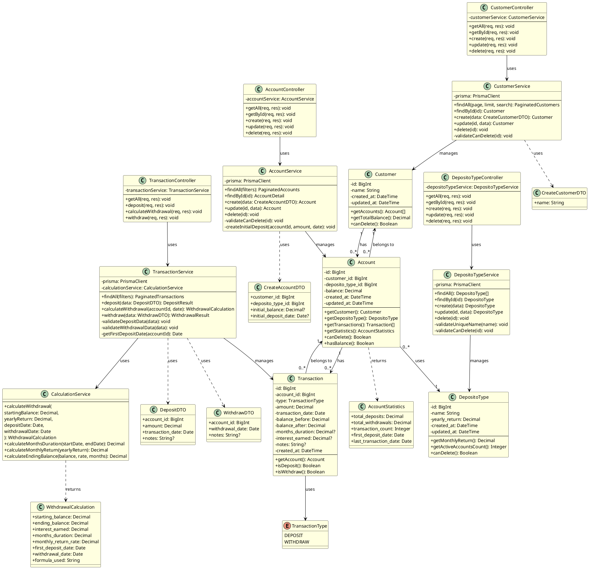
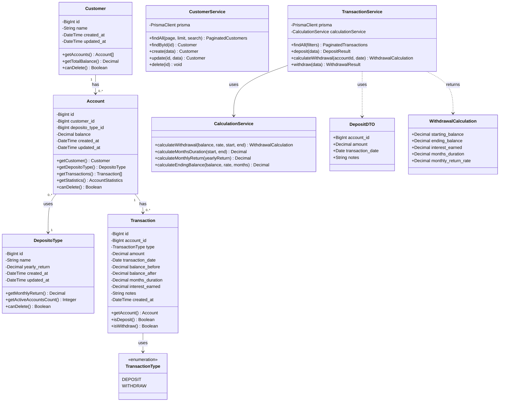

# UML Class Diagram - Bank Saving System

## Mengapa Class Diagram Penting?

**Class Diagram adalah BLUEPRINT untuk Code Structure**

### Alasan Class Diagram di Step 7:

1. ✅ **Database Schema → Classes** - Mapping dari database ke OOP
2. ✅ **Clear Relationships** - Visual representation of how entities relate
3. ✅ **Implementation Guide** - Developer tahu class apa yang harus dibuat
4. ✅ **Type Safety** - Basis untuk TypeScript interfaces
5. ✅ **Service Layer Design** - Business logic organization
6. ✅ **Documentation** - Visual documentation yang mudah dipahami

---

## Class Diagram Overview

### Layers:

```
┌─────────────────────────────────────────┐
│         Presentation Layer              │
│  (Controllers - Handle HTTP Requests)   │
└───────────────┬─────────────────────────┘
                │
┌───────────────▼─────────────────────────┐
│          Service Layer                  │
│  (Business Logic - Calculate, Validate) │
└───────────────┬─────────────────────────┘
                │
┌───────────────▼─────────────────────────┐
│         Repository Layer                │
│   (Database Access - Prisma Client)     │
└───────────────┬─────────────────────────┘
                │
┌───────────────▼─────────────────────────┐
│          Database Layer                 │
│    (PostgreSQL/MySQL - Persistence)     │
└─────────────────────────────────────────┘
```

---

## PlantUML Diagram



---

## Mermaid Diagram (Markdown-friendly)



---

## ASCII Diagram (Simple View)

```
┌──────────────────────┐
│      Customer        │
├──────────────────────┤
│ - id: BigInt         │
│ - name: String       │
│ - created_at         │
│ - updated_at         │
├──────────────────────┤
│ + getAccounts()      │
│ + getTotalBalance()  │
│ + canDelete()        │
└──────────┬───────────┘
           │
           │ 1
           │
           │ has many
           │
           │ *
           ▼
┌──────────────────────┐         ┌──────────────────────┐
│      Account         │    *    │   DepositoType       │
├──────────────────────┤─────────├──────────────────────┤
│ - id: BigInt         │  uses   │ - id: BigInt         │
│ - customer_id        │    1    │ - name: String       │
│ - deposito_type_id   │         │ - yearly_return      │
│ - balance: Decimal   │         ├──────────────────────┤
├──────────────────────┤         │ + getMonthlyReturn() │
│ + getTransactions()  │         │ + canDelete()        │
│ + getStatistics()    │         └──────────────────────┘
│ + canDelete()        │
└──────────┬───────────┘
           │
           │ 1
           │
           │ has many
           │
           │ *
           ▼
┌──────────────────────┐         ┌──────────────────────┐
│    Transaction       │         │  TransactionType     │
├──────────────────────┤         │   <<enumeration>>    │
│ - id: BigInt         │         ├──────────────────────┤
│ - account_id         │─────────│ DEPOSIT              │
│ - type               │         │ WITHDRAW             │
│ - amount: Decimal    │         └──────────────────────┘
│ - transaction_date   │
│ - balance_before     │
│ - balance_after      │
│ - months_duration    │
│ - interest_earned    │
├──────────────────────┤
│ + isDeposit()        │
│ + isWithdraw()       │
└──────────────────────┘


SERVICE LAYER:

┌────────────────────┐      ┌────────────────────┐
│ CustomerService    │      │TransactionService  │
├────────────────────┤      ├────────────────────┤
│ - prisma           │      │ - prisma           │
├────────────────────┤      │ - calcService      │──┐
│ + findAll()        │      ├────────────────────┤  │
│ + findById()       │      │ + deposit()        │  │
│ + create()         │      │ + withdraw()       │  │
│ + update()         │      │ + calculate()      │  │
│ + delete()         │      └────────────────────┘  │
└────────────────────┘                              │
                                                    │ uses
                                                    │
                                                    ▼
                             ┌────────────────────────────────┐
                             │   CalculationService           │
                             ├────────────────────────────────┤
                             │ + calculateWithdrawal()        │
                             │ + calculateMonthsDuration()    │
                             │ + calculateMonthlyReturn()     │
                             │ + calculateEndingBalance()     │
                             └────────────────────────────────┘
```

---

## Class Details

### 1. Entity Classes (Database Models)

#### Customer Class

**Attributes:**
- `id`: Unique identifier (auto-increment)
- `name`: Customer name (2-255 chars)
- `created_at`: Record creation timestamp
- `updated_at`: Last update timestamp

**Methods:**
- `getAccounts()`: Retrieve all accounts belonging to customer
- `getTotalBalance()`: Sum of all account balances
- `canDelete()`: Check if customer can be deleted (no accounts)

**Business Rules:**
- Name is required
- Cannot delete customer with active accounts

---

#### DepositoType Class

**Attributes:**
- `id`: Unique identifier
- `name`: Deposito type name (unique, e.g., "Gold")
- `yearly_return`: Annual interest rate (0.01-100%)
- `created_at`, `updated_at`: Timestamps

**Methods:**
- `getMonthlyReturn()`: Calculate monthly return (yearly_return / 12)
- `getActiveAccountsCount()`: Count accounts using this type
- `canDelete()`: Check if can be deleted (no accounts using it)

**Business Rules:**
- Name must be unique
- Yearly return must be > 0 and <= 100
- Cannot delete if accounts exist

---

#### Account Class

**Attributes:**
- `id`: Unique identifier
- `customer_id`: Foreign key to Customer
- `deposito_type_id`: Foreign key to DepositoType
- `balance`: Current balance (>= 0)
- `created_at`, `updated_at`: Timestamps

**Methods:**
- `getCustomer()`: Get customer object
- `getDepositoType()`: Get deposito type object
- `getTransactions()`: Get all transactions
- `getStatistics()`: Get aggregated statistics
- `canDelete()`: Check if can be deleted (balance = 0)
- `hasBalance()`: Check if balance > 0

**Business Rules:**
- Must belong to one customer
- Must have one deposito type
- Balance cannot be negative
- Cannot delete if balance > 0

---

#### Transaction Class

**Attributes:**
- `id`: Unique identifier
- `account_id`: Foreign key to Account
- `type`: TransactionType enum (DEPOSIT/WITHDRAW)
- `amount`: Transaction amount (> 0)
- `transaction_date`: User-specified date
- `balance_before`: Balance before transaction
- `balance_after`: Balance after transaction
- `months_duration`: Duration in months (withdraw only)
- `interest_earned`: Interest amount (withdraw only)
- `notes`: Optional notes
- `created_at`: System timestamp

**Methods:**
- `getAccount()`: Get associated account
- `isDeposit()`: Check if type is DEPOSIT
- `isWithdraw()`: Check if type is WITHDRAW

**Business Rules:**
- Amount must be > 0
- transaction_date cannot be future date
- For withdraw: months_duration and interest_earned required

---

### 2. Service Classes (Business Logic)

#### CustomerService

**Responsibilities:**
- CRUD operations for customers
- Business rule validation
- Data aggregation (total accounts, total balance)

**Key Methods:**
```typescript
findAll(page: number, limit: number, search: string): Promise<PaginatedCustomers>
findById(id: number): Promise<Customer>
create(data: CreateCustomerDTO): Promise<Customer>
delete(id: number): Promise<void>  // Throws if has accounts
```

---

#### TransactionService

**Responsibilities:**
- Handle deposit transactions
- Handle withdrawal transactions with interest calculation
- Transaction history management

**Key Methods:**
```typescript
deposit(data: DepositDTO): Promise<DepositResult>
calculateWithdrawal(accountId: number, date: Date): Promise<WithdrawalCalculation>
withdraw(data: WithdrawDTO): Promise<WithdrawalResult>
```

**Dependencies:**
- Uses `CalculationService` for interest calculations
- Uses Prisma for database transactions

---

#### CalculationService (CRITICAL)

**Responsibilities:**
- Interest calculation logic
- Date/duration calculations
- Formula implementation

**Key Methods:**
```typescript
calculateWithdrawal(
    startingBalance: Decimal,
    yearlyReturn: Decimal,
    depositDate: Date,
    withdrawalDate: Date
): WithdrawalCalculation

calculateMonthsDuration(startDate: Date, endDate: Date): Decimal
calculateMonthlyReturn(yearlyReturn: Decimal): Decimal
calculateEndingBalance(balance: Decimal, rate: Decimal, months: Decimal): Decimal
```

**Formula Implementation:**
```typescript
ending_balance = starting_balance × (1 + monthly_return × months)
monthly_return = yearly_return / 12 / 100
months = (years × 12) + months + (days / 30)
```

---

## Implementation Mapping

### Backend (Prisma + TypeScript)

```typescript
// Entity → Prisma Model
model Customer {
  id         BigInt    @id @default(autoincrement())
  name       String
  accounts   Account[]
  created_at DateTime  @default(now())
  updated_at DateTime  @updatedAt
}

// Service → TypeScript Class
export class CustomerService {
  constructor(private prisma: PrismaClient) {}

  async findAll(page: number, limit: number): Promise<PaginatedCustomers> {
    const customers = await this.prisma.customer.findMany({
      skip: (page - 1) * limit,
      take: limit,
      include: {
        _count: { select: { accounts: true } }
      }
    });
    return { data: customers, meta: {...} };
  }
}
```

---

### Frontend (TypeScript Interfaces)

```typescript
// Entity → Interface (no methods)
interface Customer {
  id: number;
  name: string;
  total_accounts: number;
  total_balance: number;
  created_at: string;
  updated_at: string;
}

// DTO → Interface
interface CreateCustomerDTO {
  name: string;
}

// Calculation Result → Interface
interface WithdrawalCalculation {
  starting_balance: number;
  ending_balance: number;
  interest_earned: number;
  months_duration: number;
  monthly_return_rate: number;
}
```

---

## Design Patterns Used

| Pattern | Where | Why |
|---------|-------|-----|
| **Service Layer** | CustomerService, TransactionService | Separate business logic from HTTP handlers |
| **Repository** | Prisma Client | Abstract database access |
| **DTO** | CreateCustomerDTO, DepositDTO | Data transfer between layers |
| **Value Object** | WithdrawalCalculation | Immutable calculation results |
| **Dependency Injection** | Controllers → Services | Loose coupling, testability |
| **Transaction Script** | TransactionService.withdraw() | Complex business operations |

---

## Summary

### Class Diagram Benefits:

| Benefit | Impact |
|---------|--------|
| **Clear Structure** | Developer tahu class apa yang harus dibuat |
| **Relationships Visual** | Easy understand dependencies |
| **Type Safety** | Basis untuk TypeScript interfaces |
| **Testability** | Clear boundaries untuk unit testing |
| **Maintainability** | Easy track changes and impacts |

### Implementation Checklist:

- ✅ Entity classes → Prisma models
- ✅ Service classes → Business logic layer
- ✅ Controller classes → HTTP handlers
- ✅ DTO classes → Request/response types
- ✅ CalculationService → Core formula implementation

---

**Status**: ✅ COMPLETE - Ready for Implementation
**Format**: PlantUML + Mermaid + ASCII
**Last Updated**: 2025-11-22
