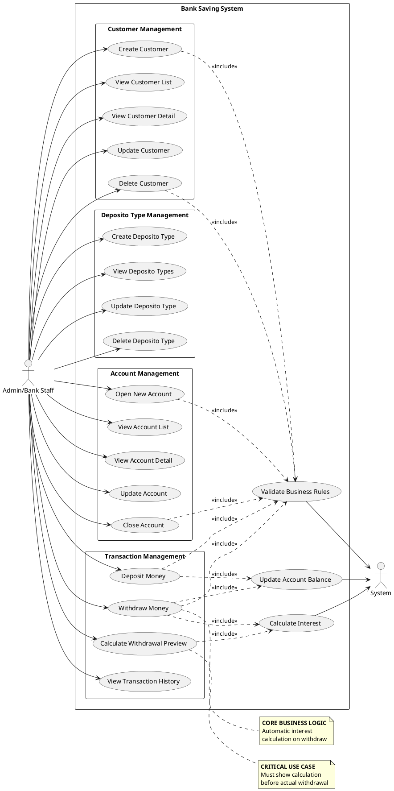
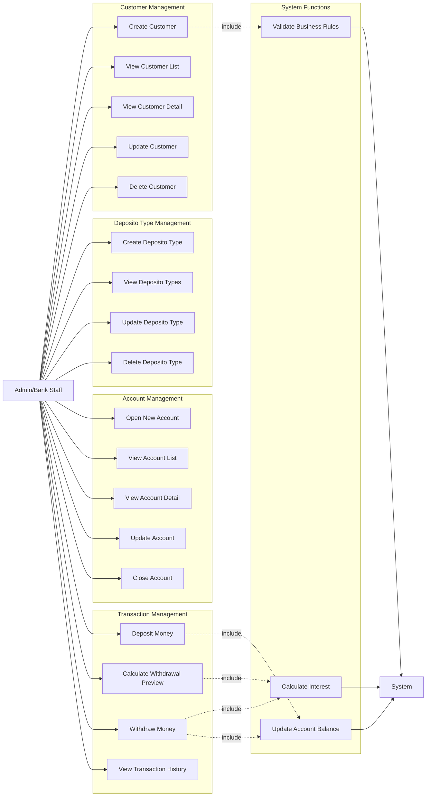

# UML Use Case Diagram - Bank Saving System

## Mengapa Use Case Diagram Penting?

**Use Case Diagram adalah VISUAL SPECIFICATION dari Functional Requirements**

### Alasan Use Case Diagram di Step 8:

1. ✅ **User-Centric View** - Focus pada apa yang user bisa lakukan
2. ✅ **Stakeholder Communication** - Non-technical people bisa understand
3. ✅ **Scope Definition** - Clear boundary: in-scope vs out-of-scope
4. ✅ **Requirement Validation** - Verify semua requirement tercakup
5. ✅ **Test Case Basis** - Foundation untuk acceptance testing
6. ✅ **Feature Prioritization** - Tahu mana critical, mana nice-to-have

---

## Actors (Users)

### Primary Actor: **Admin/Bank Staff**

**Role:** Bank employee yang manage sistem deposito

**Responsibilities:**
- Manage customers (create, update, delete)
- Manage deposito types (create, update, delete)
- Open accounts for customers
- Process deposits
- Process withdrawals
- View transaction history
- Generate reports

**Access Level:** Full access to all features

---

### Secondary Actor: **System** (Automated)

**Role:** Automated processes

**Responsibilities:**
- Calculate interest automatically
- Validate business rules
- Update balances
- Generate timestamps

---

## Use Case Diagram (PlantUML)



---

## Use Case Diagram (Mermaid)



---

## ASCII Diagram

```
                    ┌────────────────────────────────────────────┐
                    │      BANK SAVING SYSTEM                    │
                    │                                            │
  ┌──────────┐      │  ┌──────────────────────────────────┐     │
  │          │      │  │   CUSTOMER MANAGEMENT            │     │
  │  Admin/  │◄─────┼──○ Create Customer                  │     │
  │   Bank   │      │  ○ View Customer List               │     │
  │  Staff   │◄─────┼──○ View Customer Detail             │     │
  │          │      │  ○ Update Customer                  │     │
  │          │◄─────┼──○ Delete Customer                  │     │
  └──────────┘      │  └──────────────────────────────────┘     │
       │            │                                            │
       │            │  ┌──────────────────────────────────┐     │
       │            │  │   DEPOSITO TYPE MANAGEMENT       │     │
       └────────────┼──○ Create Deposito Type             │     │
                    │  ○ View Deposito Types              │     │
       ┌────────────┼──○ Update Deposito Type             │     │
       │            │  ○ Delete Deposito Type             │     │
       │            │  └──────────────────────────────────┘     │
       │            │                                            │
       │            │  ┌──────────────────────────────────┐     │
       │            │  │   ACCOUNT MANAGEMENT             │     │
       └────────────┼──○ Open New Account                 │     │
                    │  ○ View Account List                │     │
       ┌────────────┼──○ View Account Detail              │     │
       │            │  ○ Update Account                   │     │
       │            │  ○ Close Account                    │     │
       │            │  └──────────────────────────────────┘     │
       │            │                                            │
       │            │  ┌──────────────────────────────────┐     │
       │            │  │   TRANSACTION MANAGEMENT         │     │
       └────────────┼──○ Deposit Money ──┐                │     │
                    │  ○ Calculate        │                │     │
       ┌────────────┼──○   Withdrawal     ├─────┐         │     │
       │            │  ○   Preview ⭐     │     │         │     │
       │            │  ○ Withdraw Money──┐│     │         │     │
       │            │  ○   ⭐ CRITICAL   ││     │         │     │
       └────────────┼──○ View Transaction││     │         │     │
                    │  │   History        ││     │         │     │
                    │  └──────────────────┘│     │         │     │
                    │                      │     │         │     │
                    │  ┌───────────────────▼─────▼─────┐   │     │
  ┌──────────┐      │  │   SYSTEM FUNCTIONS           │   │     │
  │          │      │  ○ Calculate Interest ◄──────────┘   │     │
  │  System  │◄─────┼──○ Validate Business Rules          │     │
  │          │      │  ○ Update Account Balance ◄──────────┘     │
  └──────────┘      │  └──────────────────────────────────┘     │
                    │                                            │
                    └────────────────────────────────────────────┘
```

---

## Use Case Detailed Specifications

### UC1: Create Customer

**Actor:** Admin/Bank Staff

**Preconditions:**
- Admin is logged in
- Admin has permission to create customers

**Main Flow:**
1. Admin selects "Create Customer"
2. System displays customer form
3. Admin enters customer name
4. Admin submits form
5. System validates input
6. System creates customer record
7. System displays success message

**Postconditions:**
- New customer record created in database
- Customer appears in customer list

**Alternative Flows:**
- 5a. Validation fails → System shows error, return to step 3

---

### UC2: View Customer List

**Actor:** Admin/Bank Staff

**Preconditions:**
- Admin is logged in

**Main Flow:**
1. Admin navigates to customer list
2. System retrieves all customers
3. System displays paginated list with:
   - Customer name
   - Total accounts
   - Total balance
4. Admin can search by name (optional)
5. Admin can sort by name/date (optional)

**Postconditions:**
- Customer list displayed

---

### UC5: Delete Customer

**Actor:** Admin/Bank Staff

**Preconditions:**
- Admin is logged in
- Customer exists
- Customer has NO active accounts

**Main Flow:**
1. Admin selects "Delete" on customer
2. System checks if customer has accounts
3. System displays confirmation dialog
4. Admin confirms deletion
5. System deletes customer record
6. System displays success message

**Postconditions:**
- Customer record deleted from database
- Customer removed from list

**Alternative Flows:**
- 2a. Customer has accounts → System shows error "Cannot delete customer with existing accounts", process ends

---

### UC10: Open New Account

**Actor:** Admin/Bank Staff

**Preconditions:**
- Admin is logged in
- At least one customer exists
- At least one deposito type exists

**Main Flow:**
1. Admin selects "Open New Account"
2. System displays account form with:
   - Customer dropdown
   - Deposito type dropdown
   - Initial balance (optional)
   - Initial deposit date (if balance > 0)
3. Admin fills form
4. Admin submits
5. System validates:
   - Customer exists
   - Deposito type exists
   - If initial_balance > 0, date is required
6. System creates account record
7. If initial_balance > 0:
   - System creates initial deposit transaction
   - System updates account balance
8. System displays success message

**Postconditions:**
- New account created
- If initial deposit: transaction recorded, balance updated

---

### UC15: Deposit Money ⭐

**Actor:** Admin/Bank Staff

**Preconditions:**
- Admin is logged in
- Account exists

**Main Flow:**
1. Admin selects account
2. Admin clicks "Deposit"
3. System displays deposit form:
   - Amount input
   - Transaction date input
   - Notes (optional)
4. Admin enters amount and date
5. Admin submits
6. System validates:
   - Amount > 0
   - Date not in future
   - Account exists
7. **System starts database transaction:**
   - Get current balance
   - Create transaction record (type: deposit)
   - Update account balance (+amount)
   - Commit transaction
8. System displays success with new balance

**Postconditions:**
- Account balance increased
- Transaction recorded in history

**Business Rules:**
- Amount must be > 0
- Transaction date cannot be future date

---

### UC16: Calculate Withdrawal Preview ⭐⭐ CRITICAL

**Actor:** Admin/Bank Staff

**Preconditions:**
- Admin is logged in
- Account exists
- Account has at least one deposit

**Main Flow:**
1. Admin selects account
2. Admin clicks "Withdraw"
3. System displays withdrawal form
4. Admin enters withdrawal date
5. **System calculates preview:**
   - Get account balance (starting balance)
   - Get first deposit date
   - Calculate months duration
   - Get deposito yearly return
   - Calculate monthly return = yearly / 12
   - **Calculate ending balance = starting × (1 + monthly_return × months)**
   - Calculate interest earned = ending - starting
6. System displays calculation breakdown:
   - Starting balance
   - Duration (months, days)
   - Monthly return rate
   - Interest earned
   - **Ending balance (total customer receives)**
   - Formula used
7. Admin reviews calculation
8. Admin can change date → return to step 4

**Postconditions:**
- Calculation displayed
- No database changes (preview only)

**Business Rules:**
- Withdrawal date must be >= first deposit date
- Formula: `ending_balance = starting_balance × (1 + monthly_return × months)`

**Why This is CRITICAL:**
- **Requirement explicit**: "system must calculate and show to customer"
- Transparency untuk customer
- Prevent disputes
- User confirmation sebelum actual withdraw

---

### UC17: Withdraw Money ⭐⭐ CORE

**Actor:** Admin/Bank Staff

**Preconditions:**
- Admin is logged in
- Account exists
- Account balance > 0
- Admin has seen calculation preview (UC16)

**Main Flow:**
1. Admin confirms withdrawal after seeing preview
2. System validates:
   - Account exists
   - Balance > 0
   - Withdrawal date >= first deposit date
3. **System starts database transaction:**
   - Get account with deposito type
   - Get first deposit date
   - Calculate ending balance (using CalculationService)
   - Create transaction record (type: withdraw) with:
     - amount = ending_balance
     - balance_before = current balance
     - balance_after = 0
     - months_duration
     - interest_earned
   - Update account balance = 0
   - Commit transaction
4. System displays success with:
   - Total amount received
   - Interest earned
   - Final balance (0)

**Postconditions:**
- Account balance = 0
- Withdrawal transaction recorded
- Customer receives total (principal + interest)

**Business Rules:**
- Full withdrawal only (account closes)
- Interest calculated automatically
- Formula: `ending_balance = starting_balance × (1 + monthly_return × months)`

---

### UC18: View Transaction History

**Actor:** Admin/Bank Staff

**Preconditions:**
- Admin is logged in

**Main Flow:**
1. Admin navigates to transaction history (or account detail)
2. System retrieves transactions with filters:
   - By account (optional)
   - By type (deposit/withdraw)
   - By date range
3. System displays list showing:
   - Transaction date
   - Type (deposit/withdraw)
   - Amount
   - Balance before
   - Balance after
   - Interest (if withdraw)
   - Notes
4. Admin can export to CSV/PDF (optional)

**Postconditions:**
- Transaction history displayed

---

### UC19: Calculate Interest (System)

**Actor:** System (Automated)

**Triggered by:** UC16, UC17

**Process:**
1. Receive parameters:
   - Starting balance
   - Yearly return rate
   - Deposit date
   - Withdrawal date
2. Calculate months duration:
   ```
   months = (years × 12) + months + (days / 30)
   ```
3. Calculate monthly return:
   ```
   monthly_return = yearly_return / 12 / 100
   ```
4. **Calculate ending balance (CORRECTED FORMULA):**
   ```
   ending_balance = starting_balance × (1 + monthly_return × months)
   ```
5. Calculate interest earned:
   ```
   interest = ending_balance - starting_balance
   ```
6. Return calculation result

**Business Rules:**
- Use simple interest (not compound)
- Month calculation includes fractional months
- Formula must match specification

---

### UC20: Validate Business Rules (System)

**Actor:** System (Automated)

**Triggered by:** All create/update/delete operations

**Validations:**

**Customer:**
- Name required, 2-255 chars
- Cannot delete if has accounts

**Deposito Type:**
- Name required, unique, max 100 chars
- Yearly return: 0.01 - 100
- Cannot delete if accounts exist

**Account:**
- Customer must exist
- Deposito type must exist
- Balance >= 0
- Cannot delete if balance > 0
- If initial_balance > 0, deposit date required

**Transaction:**
- Amount must be > 0
- Date cannot be future
- Withdrawal date must be >= first deposit date
- Account must exist

---

### UC21: Update Account Balance (System)

**Actor:** System (Automated)

**Triggered by:** UC15 (Deposit), UC17 (Withdraw)

**Process:**
1. Begin database transaction
2. Lock account row (FOR UPDATE)
3. Get current balance
4. Calculate new balance:
   - Deposit: new = current + amount
   - Withdraw: new = 0
5. Update account.balance
6. Commit transaction

**Business Rules:**
- Must be atomic (transaction)
- Balance cannot be negative
- Concurrent updates must be handled (locking)

---

## Use Case Relationships

### Include Relationships

**Definition:** Use case A always includes use case B

```
Deposit Money ──<<include>>──> Update Account Balance
Withdraw Money ──<<include>>──> Calculate Interest
Withdraw Money ──<<include>>──> Update Account Balance
Delete Customer ──<<include>>──> Validate Business Rules
```

**Why Include?**
- Mandatory sub-functionality
- Reusable across multiple use cases
- Separation of concerns

---

### Extend Relationships

**Definition:** Use case B optionally extends use case A (not used in this system)

**Example (if implemented):**
```
View Transaction History <<extend>> Export to PDF
```

---

## Use Case Prioritization

### Critical (Must Have)

| Priority | Use Case | Why Critical |
|----------|----------|--------------|
| 🔴 P0 | UC15: Deposit Money | Core business function |
| 🔴 P0 | UC16: Calculate Withdrawal Preview | Explicit requirement |
| 🔴 P0 | UC17: Withdraw Money | Core business function |
| 🔴 P0 | UC19: Calculate Interest | Core business logic |

### High (Should Have)

| Priority | Use Case | Why Important |
|----------|----------|---------------|
| 🟠 P1 | UC1: Create Customer | Cannot create accounts without customers |
| 🟠 P1 | UC6: Create Deposito Type | Cannot create accounts without types |
| 🟠 P1 | UC10: Open New Account | Core function |

### Medium (Nice to Have)

| Priority | Use Case | Why Medium |
|----------|----------|------------|
| 🟡 P2 | UC2: View Customer List | Important but not blocking |
| 🟡 P2 | UC11: View Account List | Important but not blocking |
| 🟡 P2 | UC18: View Transaction History | Audit trail, not immediate need |

### Low (Optional)

| Priority | Use Case | Why Low |
|----------|----------|---------|
| 🟢 P3 | UC4: Update Customer | Rarely needed |
| 🟢 P3 | UC8: Update Deposito Type | Rarely needed |
| 🟢 P3 | UC13: Update Account | Rarely needed |

---

## Out of Scope

Features NOT included in this system:

❌ **User Authentication/Login** - Not mentioned in requirements
❌ **Customer Self-Service Portal** - Only admin access
❌ **Partial Withdrawal** - Only full withdrawal supported
❌ **Transfer Between Accounts** - Not in requirements
❌ **Loan Management** - Different product
❌ **Multi-Currency** - Assume IDR only
❌ **Compound Interest** - Simple interest only
❌ **Email Notifications** - Not mentioned
❌ **SMS Alerts** - Not mentioned
❌ **Mobile App** - Web only (unless bonus points pursued)

---

## Summary

### Total Use Cases: **21**

**By Category:**
- Customer Management: 5 use cases
- Deposito Type Management: 4 use cases
- Account Management: 5 use cases
- Transaction Management: 4 use cases
- System Functions: 3 use cases

**By Actor:**
- Admin/Bank Staff: 18 use cases
- System: 3 use cases

**Critical Use Cases:**
- UC16: Calculate Withdrawal Preview (explicit requirement)
- UC17: Withdraw Money (core business logic)
- UC19: Calculate Interest (core formula)

---

## Implementation Checklist

### Backend (API Endpoints)

- ✅ UC1-UC5 → `/api/v1/customers` CRUD
- ✅ UC6-UC9 → `/api/v1/deposito-types` CRUD
- ✅ UC10-UC14 → `/api/v1/accounts` CRUD
- ✅ UC15 → `POST /api/v1/transactions/deposit`
- ✅ UC16 → `POST /api/v1/transactions/calculate-withdrawal`
- ✅ UC17 → `POST /api/v1/transactions/withdraw`
- ✅ UC18 → `GET /api/v1/transactions`

### Frontend (Screens)

- ✅ UC1-UC5 → Customer management screens
- ✅ UC6-UC9 → Deposito type management screens
- ✅ UC10-UC14 → Account management screens
- ✅ UC15 → Deposit form
- ✅ UC16-UC17 → Withdraw form with preview
- ✅ UC18 → Transaction history table

---

**Status**: ✅ COMPLETE - Ready for Development
**Format**: PlantUML + Mermaid + ASCII
**Last Updated**: 2025-11-22
